<div align="center">
  <h1>PSF Core (Community Edition)</h1>
  
</div>

PSF Core is a local-first AI orchestration platform built for teams that need more than a chatbot. At its foundation is a programmable Mixture of Experts (MoE) engine that routes intelligence dynamically, pairing deterministic execution with large language model reasoning, Retrieval-Augmented Generation (RAG) pipelines, and Recursive Language Model (RLM) workflows to handle everything from structured automation to open-ended inference.

The Industrial Reflex Gateway (IRG) is where PSF Core goes further than anything else in the category. IRG bridges natural language intent to real hardware control, deterministically, safely, and at speed. A secure mod and plugin architecture with signed configurations ensures nothing runs on your infrastructure that you have not explicitly authorized.

Rounding out the platform: voice Speech-to-Text (STT) and Text-to-Speech (TTS) controls, coding and relay terminals, and access to the full Hugging Face model ecosystem, over 2.5 million models available for local deployment in just a few clicks. Open models install instantly with no API keys required. Gated and private models are fully supported too; bring your credentials and PSF Core handles the rest. No cloud dependency, no vendor lock-in. If it runs locally, PSF Core can run it.

PSF Core ships in Community Edition and Enterprise Edition, built on the same open foundation with local inference via llama.cpp and quantized GGUFs. Data Center Edition is designed for hardened deployment with SELinux, Podman, NGINX, and pluggable inference backends such as vLLM, Triton/TensorRT-LLM, and TGI.

## PSF Relay - Hardware Orchestration

PSF Relay extends the PSF Core architecture into the physical world. By combining MoE routing, IRG execution, Bindings, and Channels, Relay translates natural language prompts into real device control, reliably and without abstraction theater.

Supported hardware spans the full range of practical deployment: microcontrollers including Raspberry Pi Pico/Pico 2, Arduino Uno, and ESP32; single-board computers including Raspberry Pi 2/3+/4/5 and Orange Pi 5+/6+; and integration patterns aligned with industrial PLC ecosystems from Allen-Bradley, Siemens, Schneider Electric, Omron, and Delta.

Start by flashing a tri-color LED on a Pico with a breadboard. Scale to driving an ESP32 robot truck wirelessly from a number pad. The architecture handles both without changing your mental model.

This repository hosts the **PSF Core Community Edition** codebase for community deployment, operations, and extension.

## Screenshots + Quick Walkthrough

### 1) Main Menu
Instruction: Start here and choose the workflow card you need (`Browse & Download`, `Catalog Editor`, `PSF Relay`, `PSF Terminal`, or `PSF Coding Terminal`).

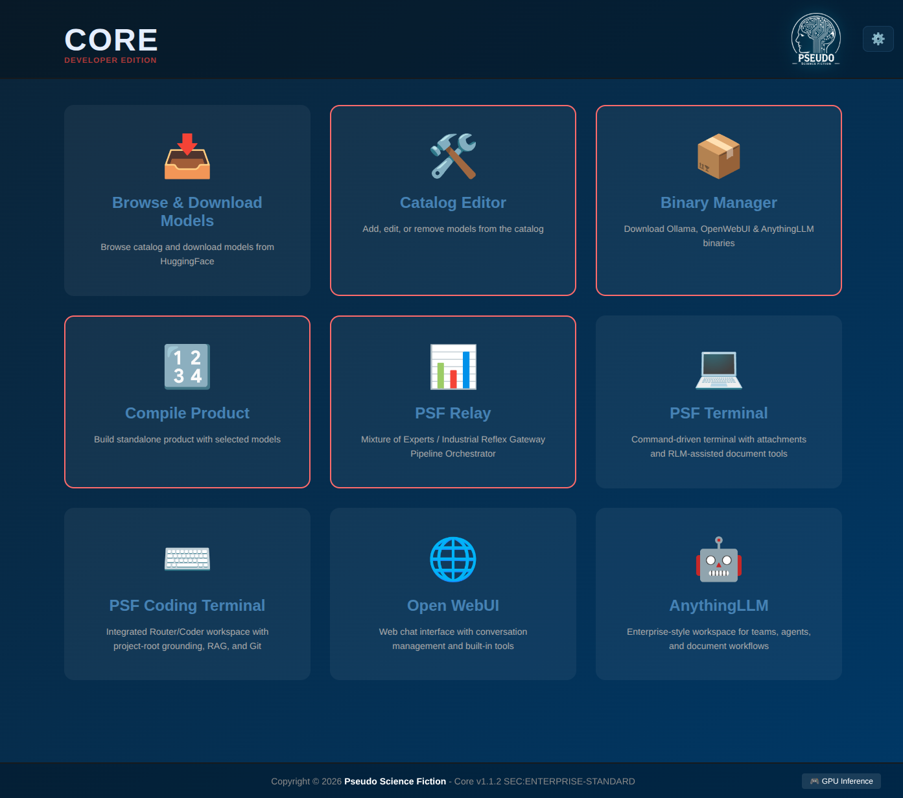

### 2) Browse & Download Models
Instruction: Open a model card, review score/runtime metadata, then use `Launch` or `Evaluate` for quick validation.

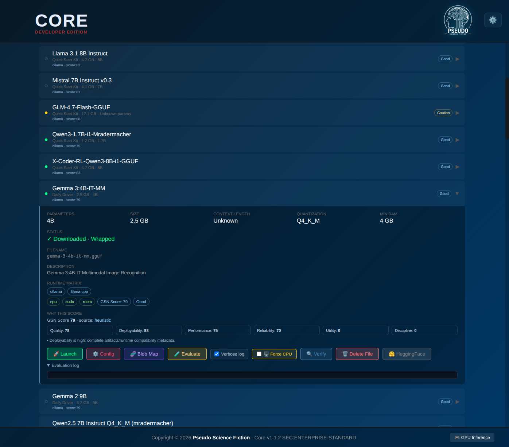

### 3) Add Hugging Face Models
Instruction: In `Catalog Editor`, click `Add`, paste HF model/page/download URLs, then use fetch actions to auto-fill metadata before saving.

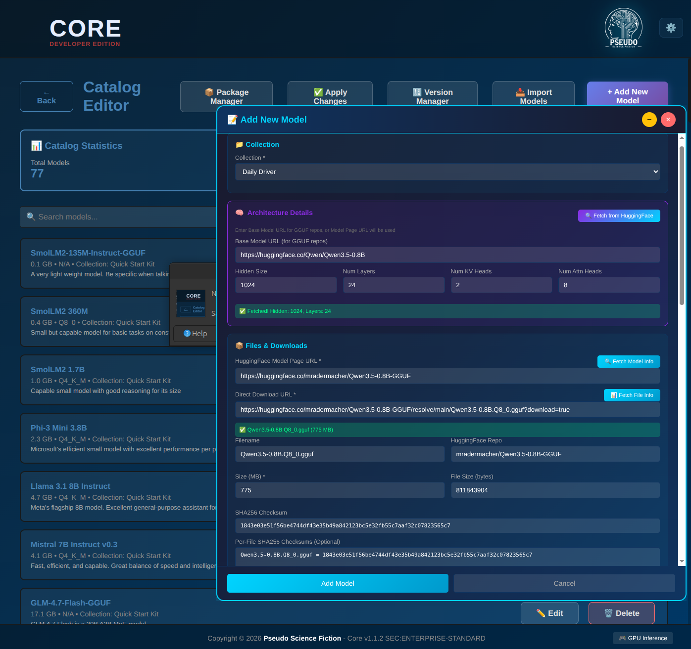

### 4) One-Click Installation
Instruction: Use `Binary Manager` to check, download, repair, or remove runtime dependencies (Ollama, voice runtime, Node, llama.cpp, etc.).

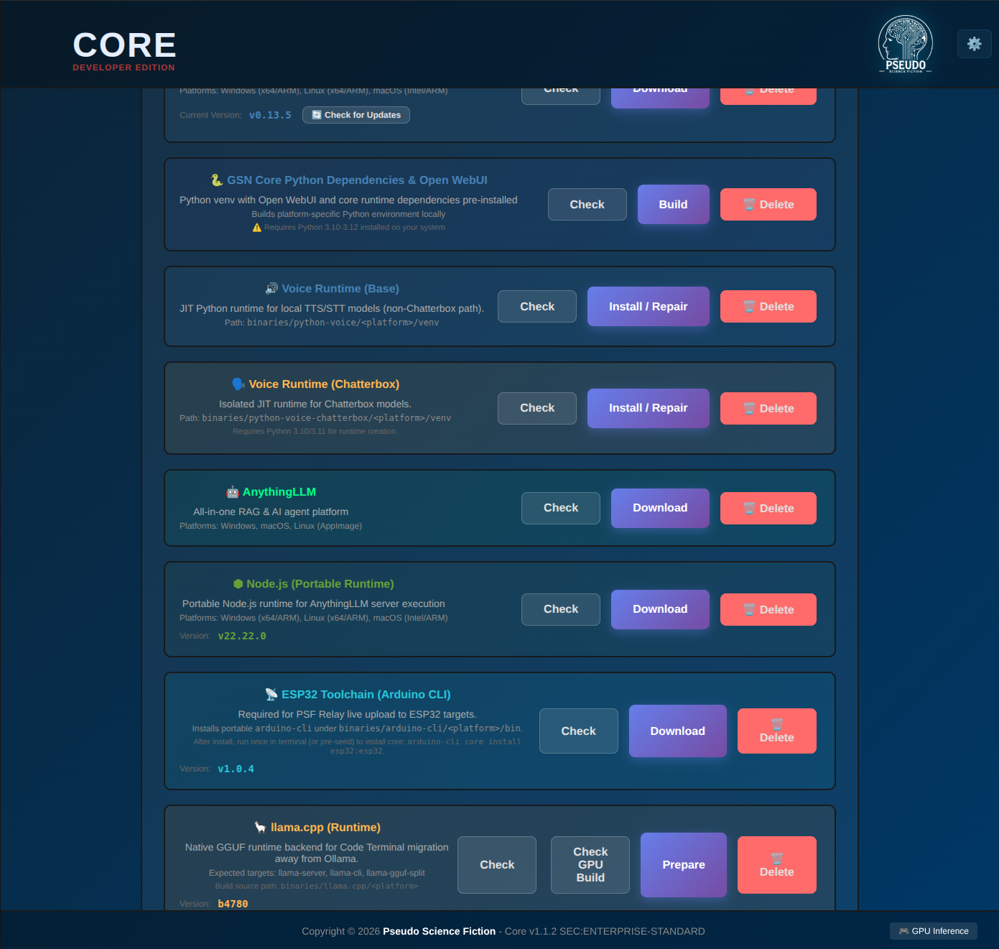

### 5) Global Settings + Secure Modding
Instruction: Open settings to configure HF key, speech/hardware, theme, system info, source control, and signed mod install/approval.

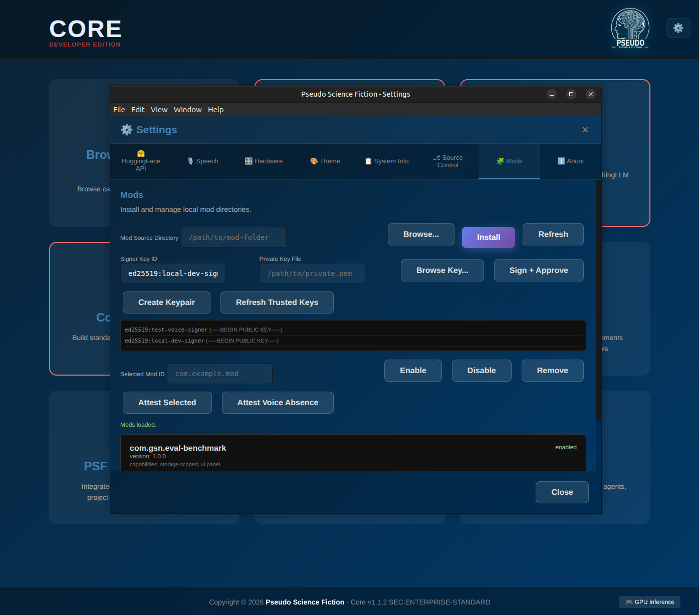

### 6) PSF Terminal with STT/TTS
Instruction: Use terminal chat for model interaction; voice controls (`Voice Off/PTT`) and model dropdown allow fast runtime switching.

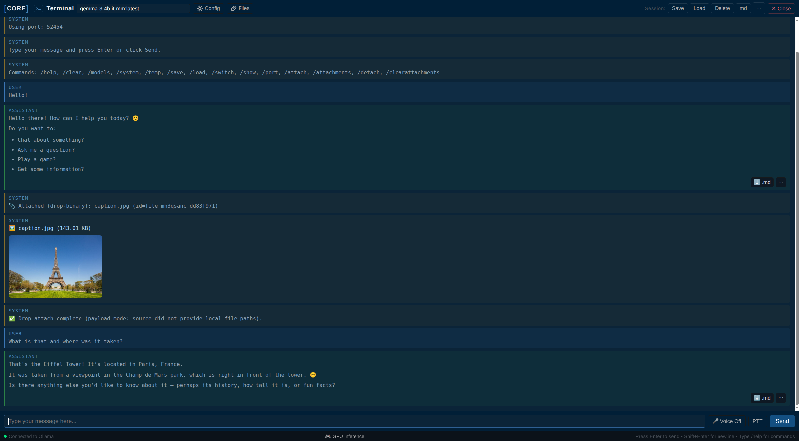

### 7) Core Relay Orchestration
Instruction: Configure pipeline agents/channels/gateway/bindings, then deploy and run routed orchestration flows.

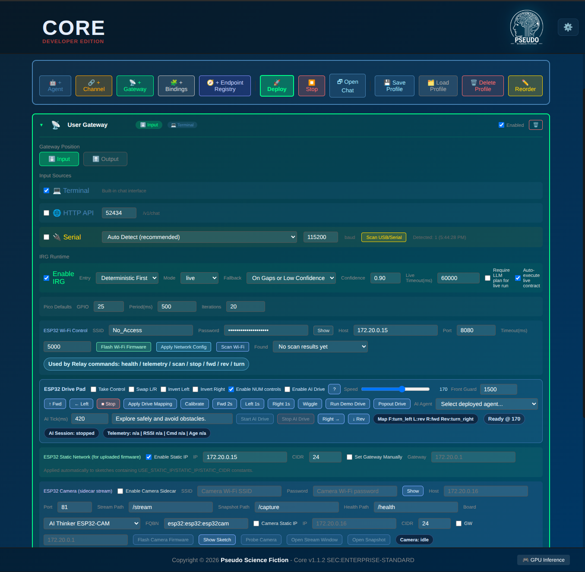

### 8) Industrial Reflex Gateway (Pipeline Chat)
Instruction: Send IRG prompt contracts through full pipeline and inspect accepted contract + generated deployable code output.

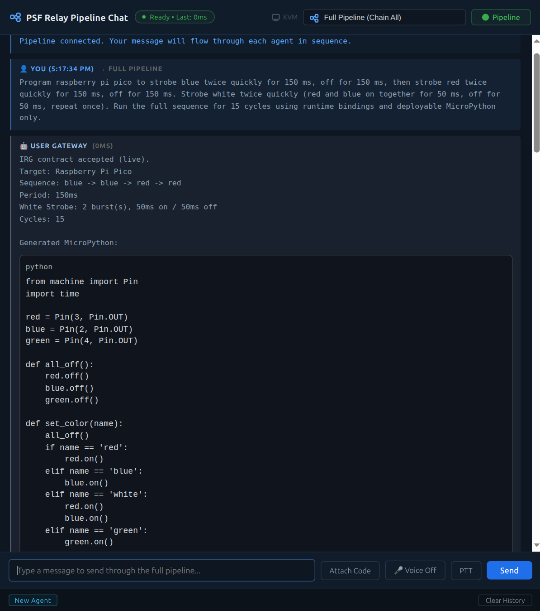

### 9) IRG Side-by-Side Context
Instruction: Keep Relay config visible while testing pipeline chat output to tune gateway/bindings and immediate execution behavior.

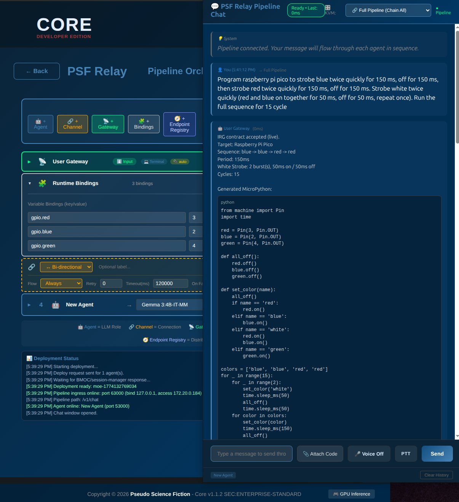

### 10) Coding Terminal Planning Stage
Instruction: Router/planner rewrites large requests into phased contracts before coder execution; review the plan before accepting output.

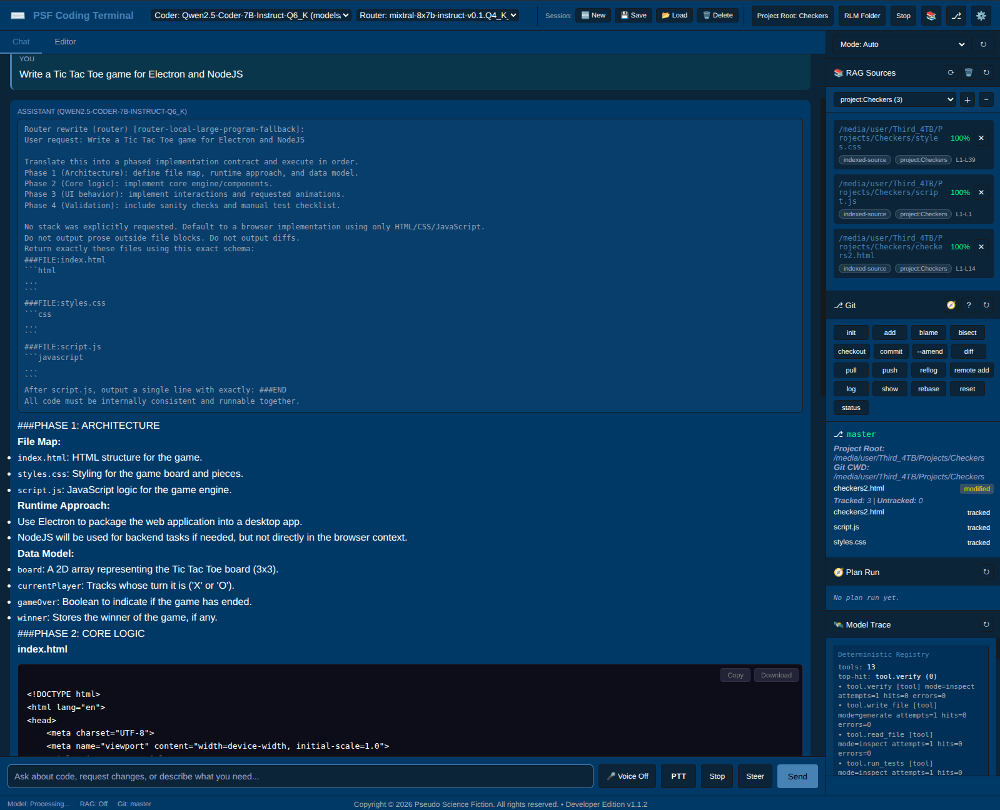

### 11) Coding Terminal Planning Stage (Output Schema)
Instruction: Verify structured file block output (`###FILE:*`) to keep multi-file generation deterministic and directly runnable.

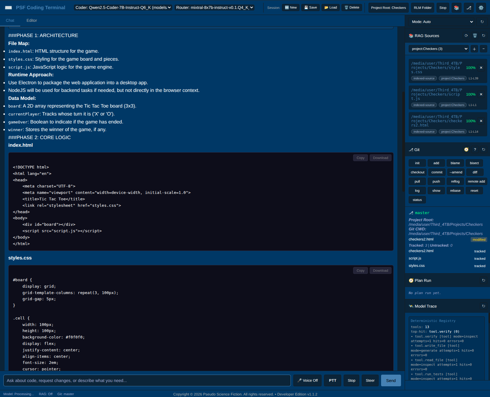

## License
- Repository code: **Apache-2.0** (see [`LICENSE`](./LICENSE))
- Commercial/private boundaries: see [`EDITION_LICENSE_MATRIX.md`](./docs/reference/EDITION_LICENSE_MATRIX.md)

## Edition Naming
- Core-CE: `Core v<version> CORE-CE`
- Community Subscription: `Core v<version> COMMUNITY SUBSCRIPTION`
- Secure Community profile: `Core v<version> CORE-CE`

Canonical naming and licensing policy is maintained in [`EDITION_LICENSE_MATRIX.md`](./docs/reference/EDITION_LICENSE_MATRIX.md).

## Repository Layout
- `launcher/` - desktop launcher/runtime and main platform modules
- `models/` - catalog/config scripts and generated catalog JSON files
- `mods/` - mod examples and mod tooling artifacts
- `docs/reference/` - architecture, release, policy, and implementation docs
- `install/` - one-time bootstrap scripts for OS-specific prerequisites
- `robot/` - robot/relay firmware examples and pipeline profiles

## Quick Start (Core - Community Edition)
1. Run the one-time OS bootstrap from the `install/` directory.
Linux/macOS:
```bash
cd install
./RUN_ONCE_MAC_LINUX.sh
```
Windows (PowerShell or CMD):
```bat
cd install
RUN_ONCE_WINDOWS.bat
```
2. Install launcher dependencies:
```bash
cd launcher
npm install
```
3. Run app (from workspace root):
```bash
./start.sh
```
Windows:
```bat
start.bat
```
macOS:
```bash
./start.command
```
4. First-run checks:
- Open `Browse & Download Models` and verify catalog loads.
- Open `PSF Relay` and load/deploy a pipeline profile if needed.
- Open settings and confirm hardware/runtime detection is healthy.

## Branch Workflow
- `main`: integration branch
- `feat/*`: active feature work
- merge feature -> `main` when verified, then start next feature branch

## Hugging Face Token Storage
- Preferred workflow: use the **Settings gear** (`API Keys` tab) to set/save your Hugging Face token
- The app writes and reads the token from hidden `.env` as `HUGGINGFACE_TOKEN`
- The token is not persisted in `models/psf-settings.json`
- `.env` is git-ignored in this repository

Reference `.env` format (advanced/manual use only):
```bash
# Local secrets only (git-ignored)
HUGGINGFACE_TOKEN=hf_your_real_token_here
```

## Security
- Report vulnerabilities privately: see [`SECURITY.md`](./SECURITY.md)
